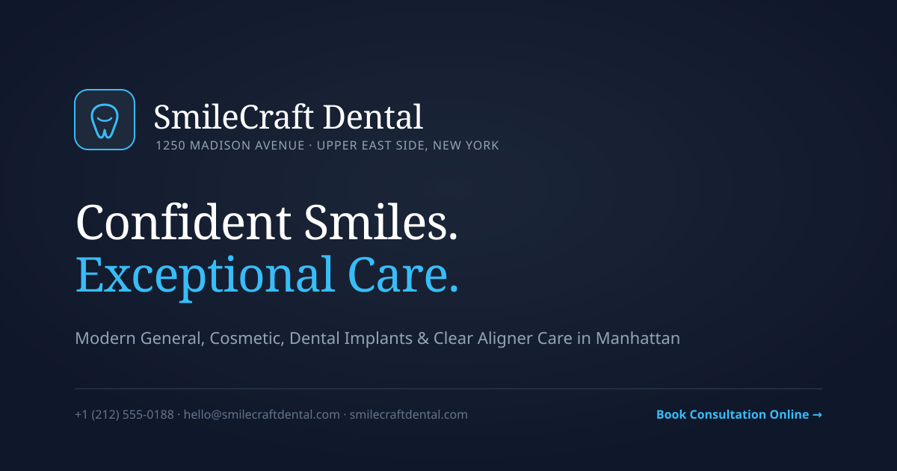
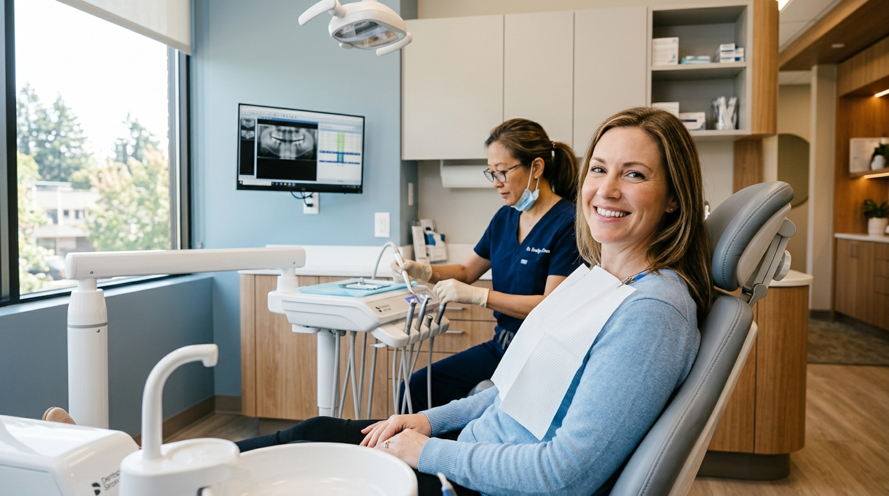
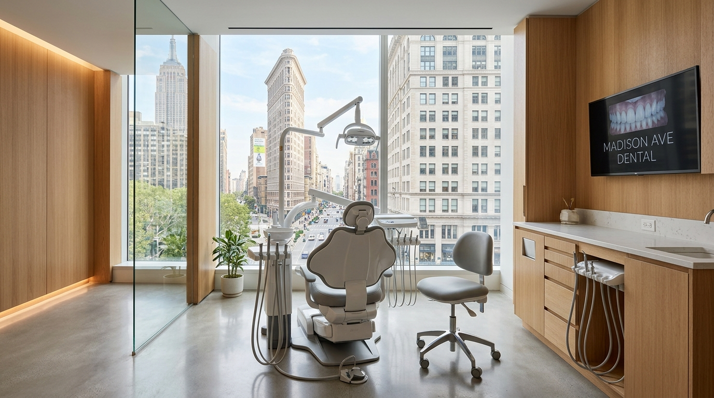

<p align="center">
  
</p>

# SmileCraft Dental — Premium Dental Practice Website

[](https://vitejs.dev/)
[](https://react.dev/)
[](https://tailwindcss.com/)
[](https://www.typescriptlang.org/)
[](https://www.netlify.com/)

**SmileCraft Dental** is a production-grade, conversion-optimized dental clinic website engineered for a luxury private practice on **Madison Avenue, New York**. Designed with clinical sophistication, local SEO dominance, accessibility compliance, and one-click deployment for **Netlify**.

> *"Confident Smiles. Exceptional Care."*

---

## 🌟 3 Key Architectural Highlights

### 1. Medical Luxury Design System (Anti-AI Slop)
Crafted with an editorial palette: off-white surfaces (`#FCFDFF`), deep slate navy (`#0F172A`), subtle medical sky accents (`#0284C7`), and high-legibility dark charcoal typography. Headings feature the timeless, warm serif **Newsreader**, paired with **Plus Jakarta Sans** for body and UI elements. Fully adheres to zero-pill metadata discipline, single-elevation cards, and natural human editorial pacing.

### 2. Complete 12-Page Clinical & Service Architecture
Provides dedicated, search-optimized landing pages for high-value dental services:
- **Dental Implants**: 3D CBCT guided planning, bone preservation mechanics, and custom zirconia restorations.
- **Cosmetic Dentistry**: Bespoke porcelain veneers, in-office whitening, and facial harmony previews.
- **Invisalign Aligners**: Optical 3D iTero scanning, SmartTrack polymer benefits, and candidacies.
- **Emergency Dentistry**: High-urgency triage page with immediate one-click calling (`+1 (212) 555-0188`) and trauma protocols.
- **Our Doctors**: Ivy League profiles and credentials for Dr. Sarah Mitchell, Dr. James Carter, and Dr. Emily Parker.
- **About, Reviews, FAQ, Contact, and Book Appointment**: Frictionless user journeys driving consultation requests.

### 3. Turnkey Netlify Production & Local SEO Engineering
- **Instant Netlify Deployment**: Configured via `netlify.toml` and `_redirects` with single-page application fallback (`/* -> /index.html 200`).
- **Serverless Netlify Forms**: Ready-to-use form handling with pre-rendered discovery templates for appointment requests and contact messages, complete with spam honeypot (`bot-field`).
- **Local SEO & Schema.org**: Route-specific meta titles, descriptions, canonical URLs, XML sitemap, `robots.txt`, and embedded JSON-LD (`Dentist` and `FAQPage`).

---

## 📸 Website Visual Showcase

### Primary Hero Experience
Modern dentistry, personalized treatment, and unhurried care in a tranquil Upper East Side setting.

<p align="center">
  
</p>

### The Clinical Sanctuary
State-of-the-art operatory on Madison Avenue with ergonomic patient seating, natural daylight, and low-radiation 3D imaging.

<p align="center">
  
</p>

---

## 🗺️ Information Architecture & Routing

Every route supports direct URL access, browser refreshes, and back/forward navigation:

| Route | Page | Purpose & Conversion Goal |
| :--- | :--- | :--- |
| `/` | **Home** | Editorial overview, trust strip, services bento, doctors, reviews, and appointment CTA. |
| `/services` | **All Services** | Categorized clinical catalog (Restorative, Cosmetic, Orthodontic, Preventive, Urgent). |
| `/services/dental-implants` | **Dental Implants** | Dedicated restorative landing page with candidacy criteria and 4-step treatment timeline. |
| `/services/cosmetic-dentistry` | **Cosmetic Dentistry** | Bespoke smile design, porcelain veneers, bonding, and digital smile preview philosophy. |
| `/services/invisalign` | **Invisalign** | Clear aligner treatment without putty impressions; adult & teen candidacy guide. |
| `/services/emergency-dentistry` | **Emergency Dentistry** | Urgent triage page featuring immediate click-to-call hotline and first-aid instructions. |
| `/doctors` | **Our Doctors** | Academic credentials, hospital residencies, and clinical specialties of our clinicians. |
| `/about` | **About Practice** | Practice philosophy, anxiety-alleviating environment, and 4 core clinical pillars. |
| `/reviews` | **Patient Reviews** | Filterable patient experiences with star ratings and treatment categories. |
| `/faq` | **FAQ Knowledge Base** | Searchable accordions covering appointments, implants, aligners, and dental insurance. |
| `/contact` | **Contact & Location** | Interactive vector map of 1250 Madison Avenue, transit directions, and message form. |
| `/book-appointment` | **Book Appointment** | Multistep lead-generation booking form with preferred clinician and time-of-day slots. |
| `/privacy-policy` | **Privacy Policy** | Data safety statement detailing no collection of sensitive health records on public forms. |
| `/*` (Fallback) | **Custom 404** | Branded page not found with navigation paths back to Home, Services, and Booking. |

---

## 💻 Tech Stack & Dependencies

- **Build Tool**: [Vite 8](https://vitejs.dev/) with optimized Rolldown code splitting (`vendor`, `icons`, `index`).
- **Core**: [React 19](https://react.dev/) + [TypeScript 7](https://www.typescriptlang.org/).
- **Styling**: [Tailwind CSS 4](https://tailwindcss.com/) with native `@import "tailwindcss";` and custom typography tokens.
- **Icons**: [Lucide React](https://lucide.dev/) (clean medical and navigation icons).
- **Typography**: Google Fonts (*Newsreader* editorial serif + *Plus Jakarta Sans* geometric body).

---

## 🚀 Getting Started

### 1. Clone & Install

```bash
git clone https://github.com/your-username/smilecraft-dental.git
cd smilecraft-dental
npm install
```

### 2. Run Local Development Server

```bash
npm run dev
```

Open [http://localhost:3000](http://localhost:3000) in your browser.

### 3. Production Build & Verification

```bash
# Build optimized static distribution bundle into dist/
npm run build

# Run TypeScript typecheck
npm run lint

# Preview the production build locally
npm run preview
```

---

## 🌐 Netlify Deployment Guide

SmileCraft Dental is configured out-of-the-box for continuous deployment on **Netlify**.

### Step 1: Connect Repository
1. Push this project to your GitHub, GitLab, or Bitbucket account.
2. In the [Netlify App](https://app.netlify.com/), click **Add new site** → **Import an existing project**.
3. Select your repository.

### Step 2: Build Settings
Netlify automatically reads the bundled `netlify.toml` file:
- **Build command**: `npm run build`
- **Publish directory**: `dist`

### Step 3: Environment Variables (Optional)
Configure under **Site configuration** → **Environment variables**:
- `VITE_SITE_URL`: `https://smilecraftdental.netlify.app` (or your custom domain)
- `VITE_GA_MEASUREMENT_ID`: Google Analytics 4 Measurement ID (if tracking is desired)

### Step 4: Deploy & Verify
Click **Deploy site**. Once published:
1. Verify direct route loading (e.g. `/services/dental-implants`).
2. Test the **Book Appointment** and **Contact** forms — entries will automatically appear under the **Forms** tab in Netlify.
3. Test 404 handling by visiting any invalid URL (e.g. `/invalid-page`).

---

## 🛡️ Form Security & Privacy Standards

- **Serverless Form Processing**: Submissions use URL-encoded POST requests compatible with Netlify Forms.
- **Spam Prevention**: Hidden honeypot field (`bot-field`) intercepts automated spam bots.
- **Data Hygiene**: In strict accordance with healthcare privacy standards, **no patient or medical data is saved in localStorage or browser cookies**.
- **Transparent Confirmation**: After submission, the booking flow explains that appointment times are tentative pending personal confirmation from the clinic care coordinator.

---

## 📄 License & Portfolio Disclaimer

This project is created for **professional design, web development, and local SEO portfolio showcase**. 
Clinician names, biographies, patient reviews, and clinic contact points represent fictional demonstration data.

*Crafted with precision for modern healthcare excellence.*
